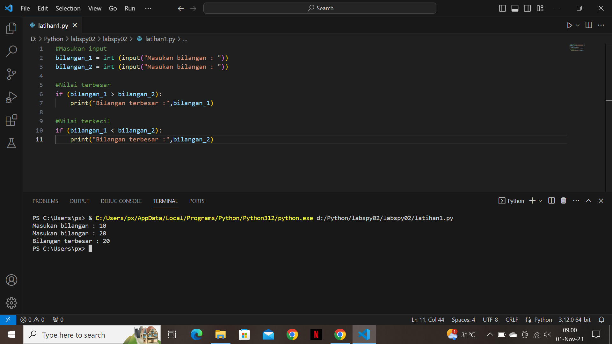
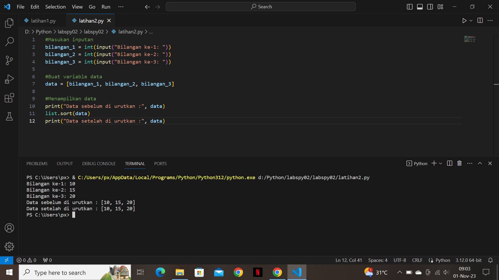
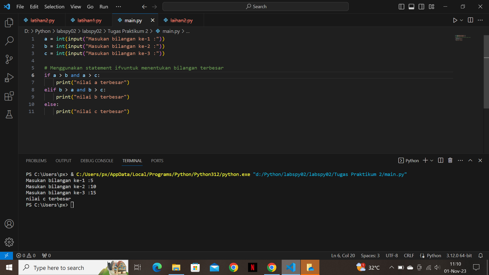
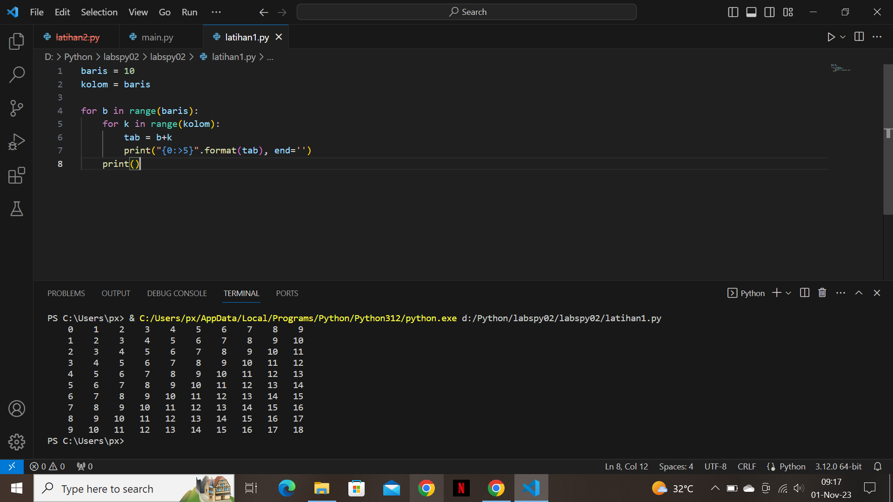
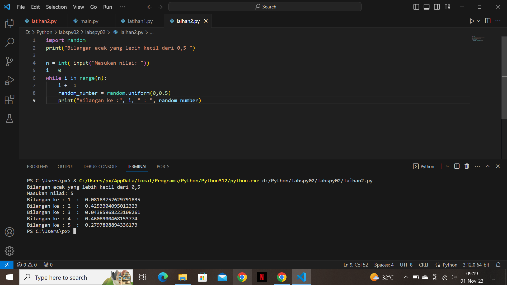

# Tugas Struktur Kondisi
# Latihan 1
<p>Buat program sederhana dengan input 2 buah bilangan, kemudian tentukan bilangan terbesar dari kedua bilangan tersebut menggunakan pernyataan if.</p>
<p>Ini adalah tampilannya :</p>


# Latihan 2
<p>Buat program untuk mengurutkan data berdasarkan input sejumlah data (minimal 3 input variabel atau lebih), kemudian tampilkan hasilnya secara mulai berurutan dari data terkecil.</p>
<p>Ini adalah tampilannya :</p>


# Tugas Praktikum 2
# Latihan 1
<p>Buat program sederhana dengan input tiga buah bilangan, dari bilangan ketiga tersebut tampilkan bilangan terbesarnya. Gunakan pernyataan jika :</p>

- a,b,c sebagai inputan 
- `max = a` Dekralasi variable
- `if` jika b lebih besar dari a/max, maka max = a
- `if` jika c lebih besar dari a/max, maka max = c
<p>Ini adalah tampilannya :</p>


# Tugas Perulangan
# Latihan 1
<p>Buat program dengan perulangan bertingkat (nested) untuk menghasilkan output sebagai berikut:</p>

1. Pendeklarasian variable
```python
baris = 10
kolom = baris
```
2. Untuk perulangan baris dan kolom menggunakan `for`
```python
for b in range(baris):
    for k in range(kolom):
        tab = b+k
``` 
3. Untuk menampikan hasil dari perulangan
     * Agar terlihat rapih menggunakan `format string` rata ke kanan sebanyak 5 karakter
     * Agar tidak membuat baris baru menggunakan `end=''` (baris)
```python
  print("{0:>5}".format(tab), end='')
print()    
```
<p>Ini adalah tampilannya :</p>


# Latihan 2
<p>Tampilkan n bilangan acak yang lebih kecil dari 0,5. nilai n diisi pada saat runtime Anda bisa menggunakan kombinasi while dan untuk menyelesaikannya.</p>

- `import random` Untuk membuat bilangan acak
- `n = int(input("Masukan nilai: "))` Menentukan jumlah input & di konversikan dalam bilangan bulat-dimasukan ke variable `n`
- `while i in range(n)` Pengulangan
- Menampilkan urutan sesuai inputan dengan hasil di bawah 0.5
```python
random_number = random.uniform(0,0.5)
    print("Bilangan ke :", i, " : ", random_number)
```
<p>Ini adalah tampilannya :</p>


